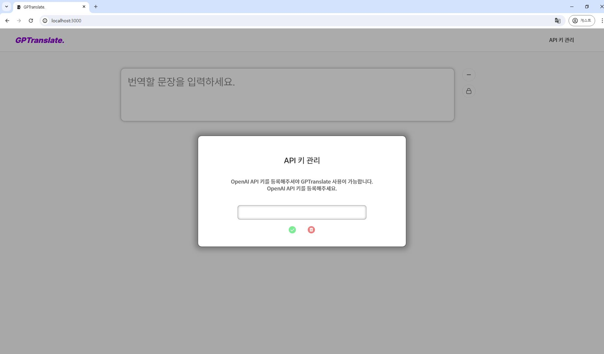
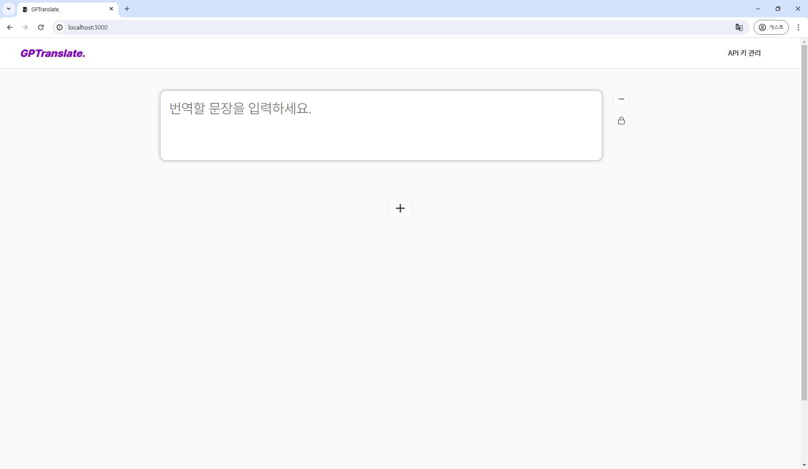
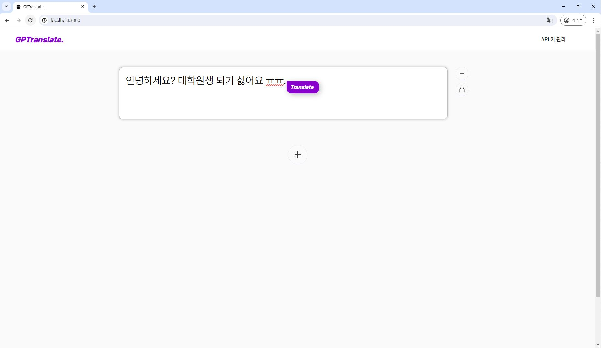
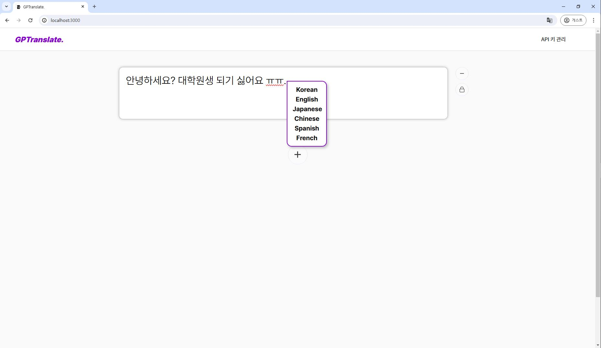
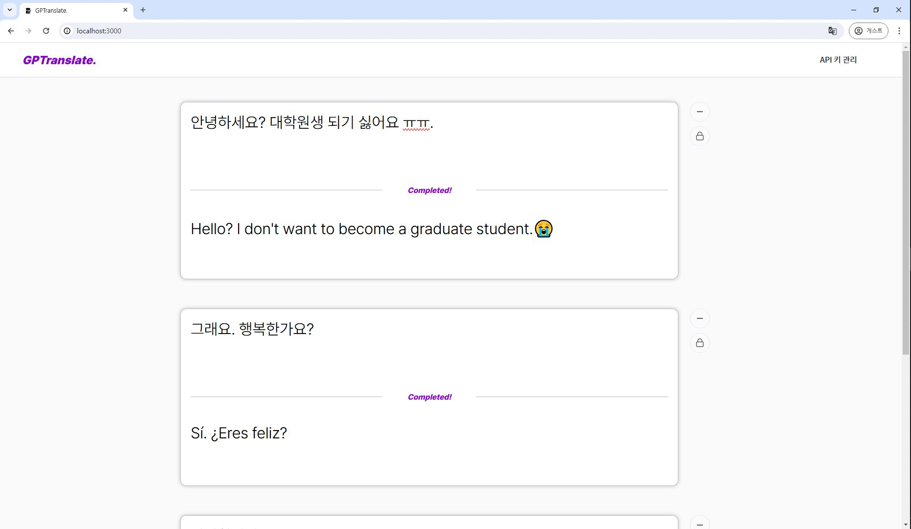

# GPTranslate

> **맥락**과 **전문적인 용어들**까지 효과적으로 번역해주는 **GPT 기반** 번역 웹.

가볍다! 편하다!

### 이런 사람에게 좋아요

- 논문이나 전문적인 단어가 많이 들어간 번역의 경우
- 각종 슬랭이나 맥락을 파악한 적절한 번역이 필요한 경우
- GPT한테 번역을 맡기고 싶은데, 채팅 UI가 불편하고 채팅을 하나하나 치기 귀찮은 경우

### 이 웹의 장점

- 최대 20개까지 추가 가능한 Cell 단위의 번역으로 전후 번역문과 다른 번역까지 한번에 비교할 수 있어요.
- GPT가 번역해주기 때문에 번역 성능이 비교적으로 정확하고 포괄적인 맥락에서의 의미, 전문적인 지식에 대한 정보를 모두 이해할 수 있어요.

### 기능 설명

{: width="40%"}
{: width="40%"}

1. API 키를 추가하셔야 사용이 가능합니다. Group Key가 아니라 Personal Key(legacy)로 받으셔야 합니다. 여기서, 등록된 API 키 삭제도 가능합니다.

{: width="40%"}

2. 번역할 문장을 입력하면 자동으로 Translate 버튼이 나옵니다. 여기서 원하는 언어를 선택하시면 됩니다.

{: width="50%"}

3. 해당 셀의 아래쪽에 번역문이 표시됩니다.
4. - 버튼을 눌러 셀을 추가할 수도 있어요. 반대로 - 버튼을 눌러 셀을 없앨 수도 있어요. 잠금 버튼을 누르면 지워지지도, 수정되지도 않게 셀을 잠글 수 있습니다.

### 사용된 개발 스택

- FrontEnd는 ReactJS를, BackEnd는 AWS Lambda를 통해 컴퓨팅 리소스를 줄였어요.
- 상태관리에는 MobX를 썼답니다.
- API Key는 기본적으로는 SSL 기반의 통신으로 안전하겠지만 그래도 대칭키 암호화 과정이 있어요.(작업 중)

### 발전시켜나갈 부분

- 더 많은 언어가 번역되게 만들어요.
- Node.js를 사용해서 Stream 과정을 통해 번역 체감 시간을 줄여요.
- UX를 더 개선해요.
- 보안 면에서 조금 더 강건하게 만들 거에요.
- 셀 기반의 UX이니만큼 각 셀에 단순히 텍스트 번역 말고도 다양한 기능을 붙여볼 거에요.

### 개발 후기

- 사실 이전 프로젝트 팀에서 소규모 팀으로 해서 각자 공부용 사이드프로젝트로 만들기로 했다가 엎어져서 몇 개월째 바쁘다는 이유로, 만들려고 하니 이런저런 생각이 나서, 미뤄두고 있었는데 만드니까 후련해요.
- 사실 백엔드+프론트엔드 다 해서 거의 3~4일 걸렸는데... 프론트는 진짜 크게 어렵지 않은데 AWS 람다 사용하는 게 마냥 편하지는 않았어요.
- 그래도 숙제 끝낸 느낌이라 좋습니다~
- 할거 엄청 많긴 한데 가끔 심심할 때마다 CNN 써서 OCR을 해보든 Whisper 쓰거나 해서 영상, 음성 번역 하든 뭐 그래도 좋겠네요.
- 약간 이번 프로젝트는 UX적 발전에 초점을 맞추고 개발해본 건데, 파파고나 구글 번역 같은 UX와는 조금 달라서 좋은 듯 해요.
